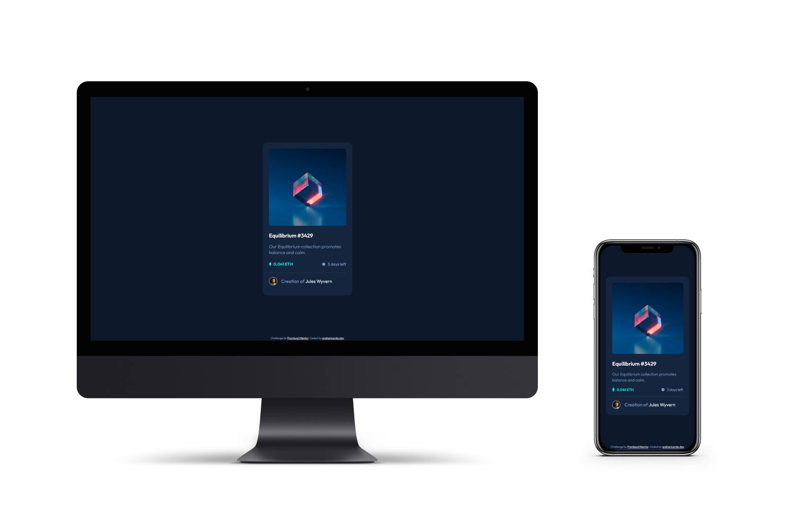

# Frontend Mentor - NFT preview card component solution

This is a solution to the NFT [NFT preview card component challenge on Frontend Mentor](https://www.frontendmentor.io/solutions/nft-preview-card-component-using-sass-6nErO4hS9T). Frontend Mentor challenges help you improve your coding skills by building realistic projects. 

## Screenshot

## Links

- Solution URL: [Github](https://github.com/andrericardoweb/frontendmentor-challenges/tree/main/nft-preview-card-component)
- Live Site URL: [https://andrericardoweb.github.io/frontendmentor-challenges/nft-preview-card-component/](https://andrericardoweb.github.io/frontendmentor-challenges/nft-preview-card-component/)

## Built with
   

## Author

- Website - [andrericardo.dev](https://www.andrericardo.dev)
- Frontend Mentor - [@andrericardoweb](https://www.frontendmentor.io/profile/andrericardoweb)
- Linkedin - [@andrericardodev](https://www.linkedin.com/in/andrericardodev/)
- Instagram - [@andrericardo.dev](https://www.instagram.com/andrericardo.dev/)

